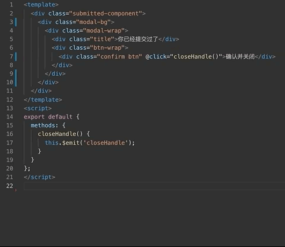

# css extract

这是一款简单的 css 提取工具，可以将 html 中 css 进行提取，然后生成 scss 的格式打印出来。选中你需要的 html 文本，按下 cmd+p，然后你的剪贴板中应该存在了提取的 scss 模板。在类似 vue 这样的模板组件时，可以直接 cmd+p 直接生成 style 样式。

## Features

## Release Notes

### 0.1.0

初始化提取功能，支持 template 模板文件，和选区。生成 scss 嵌套结构。
